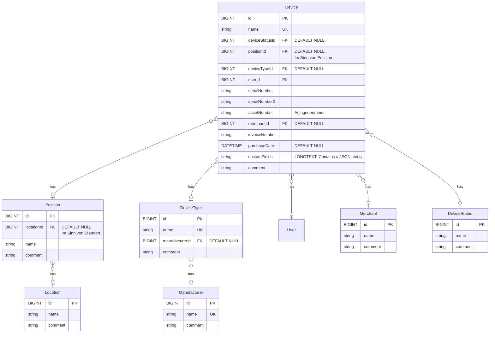

# ITAM

ITAM (IT Asset Management) ist eine Nextcloud Erweiterung zur Verwaltung von Hardwaregeräten und Softwarelizenzen.
Das Programm richtet sich an kleine und mittelständische Unternehmen (KMU) sowie Privatpersonen.

* MIT-Lizenz
* kostenfreie Nutzung
* Release im Nextcloud Appstore zur einfacheren Installation ist geplant.


## Timeline

* Device Entität umsetzen:
  - Entität in Datenbank erstellen
  - Button "Neu" hinzufügen
  - Detail-Seite erstellen zum Anlegen und Bearbeiten
  - Liste darstellen
  - Einträge bearbeiten
  - Einträge löschen

* DeviceStatus Entität umsetzen
  - Entität in Datenbank erstellen
  - Menüpunkt zum Verwalten von DeviceStati hinzufügen (verlinkt auf die Liste)
  - Liste darstellen
  - Button "Neu" hinzufügen
  - Einträge verwalten (CRUD)
    - nur Löschen, wenn ein Status nicht mehr in Device verwendet wird.
  - DeviceStatus in den Menüpunkten zum Verwalten von Geräten (Device) hinzufügen.


## Aktuelle Funktionen

Keine

## Kommende Funktionen

1. Hardware Inventar
2. Lizenz Management
3. Reporte und Exporte


### Kommende Funktionen: 1. Hardware Inventar

Inventarisierung und Verwaltung von Hardware, bspw. Computer, Monitore, Notebooks, Laptops, Telefone, Headsets, Tastaturen, Mäuse, ...

Ein Datensatz im Inventar besteht unter anderem aus diesen Feldern:

- Geräte-Name
- Standort (bspw. "Filiale Allgäu" oder "Campus 1, Block A")
- Position (Arbeitsplatz 217)
- Kauf-Datum
- Verkäufer
- Inventarnummer (kaufmännisches Inventar)

und weitere. Die Felder sind neben Standard-Feldern flexibel erweiterbar.


### Kommende Funktionen: 2. Lizenz Management

Manage deine Software-Lizenzen.


### Kommende Funktionen: 3. Reporte und Exporte

ITAM unterstützt bei der Erstellung von Berichten und Exporten.
Jeder Report umfasst eine flexible Auswahl an Datensätzen und Feldern in auswählbarer Reihenfolge.
Es werden 2 Export-Formate unterstützt: druckbare HTML-Seiten und CSV-Dateien.

## Systemvoraussetzungen

1. Nextcloud Version 33.x

## Installation

1. Projektordner in custom_apps oder apps verschieben.

2. Nextcloud Admin > Benutzer Icon (oben rechts) > Apps > Links im Menü "Deine Apps" > IT Asset Management<br>a) Custom App installieren<br>Aktivieren

<br><br>
---

# Entwickler Dokumentation


## Verwendete Technologien während der Entwicklung

* Docker Container (Beispiel docker-compose.yml siehe unten)

* Nextcloud

* Vue.js

* PHP

## Beispiel der Installation der Entwicklungsumgebung

### 1. Docker installieren

### 2. Ordner für das Projekt erstellen.
```
mkdir sfxonitam
chdir sfxonitam
```

### 3. docker-compose.yml in neuen Ordner kopieren oder erstellen:

```
nano docker-compose.yml
```

Datei-Inhalt:

```yml
version: "3"

services:
  itam:
    image: nextcloud:latest
    container_name: itam
    restart: always
    ports:
      - "88:80"
      - "22:22"
    networks:
      - web
    environment:
      - XDEBUG_ENABLED=1
      - XDEBUG_REMOTE_HOST=172.17.0.1
      - VIRTUAL_HOST="itam.local"
      - VIRTUAL_PORT=88
    volumes:
      - "./:/var/www/html"
      - "itam_db:/var/lib/mysql"
  itam_db:
    image: mariadb:latest
    container_name: mysql_itam
    networks:
      - web
    environment:
      - MYSQL_ROOT_PASSWORD=root
      - MYSQL_USER=nextcloud
      - MYSQL_PASSWORD=nextcloud
      - MYSQL_DATABASE=nextcloud
networks:
  web:
    external: false
volumes:
  itam_backend_cache:
    driver: local
  itam_db:
    driver: local
```

### 4. Docker Container starten

```bash
docker compose up -d
```

### 5. SSH im Docker Container installieren

```bash
# In den Container wechseln
docker exec -it itam bash

# Dann im Container:
apt-get update
apt-get install -y openssh-server
mkdir -p /var/run/sshd
echo 'root:root' | chpasswd
sed -i 's/#PermitRootLogin prohibit-password/PermitRootLogin yes/' /etc/ssh/sshd_config
service ssh start
```

Benutzername und Passwort lauten für den Zugriff auf den Docker-Container dann:
User: root
Pass: root

ssh -p 22 root@localhost

Das ist keine dauerhafte Lösung. Killt man den Container bspw. mit docker-compose down, ist der SSH-Server weg.
Langfristig wäre eine Implementierung mittels Dockerfile besser geeignet.

### 6. NPM installieren

```bash
ssh -p 22 root@localhost

cd /var/www/html/custom_apps/sfxonitam

nvm use --lts

node -v
```

Die Versionsnummer sollte ausgegeben werden. Es ist in der Regel nur notwendig, dass man über der benötigten Version liegt.
Nur in Ausnahmefällen sollte man exakt die in der beim kompilieren angegebene avisierte nmp Version verwenden.
Da hier nvm eingesetzt wird, sollte ein Wechsel dorthin kein Problem darstellen.

```bash
npm install
npm i --save @nextcloud/axios @nextcloud/dialogs @nextcloud/initial-state @nextcloud/l10n @nextcloud/router @nextcloud/vue-richtext vue-material-design-icons vue-click-outside
npm i --save-dev vite-plugin-eslint vite-plugin-stylelint


```

### 7. Einige ESLint Regeln deaktivieren (Optional)

Das reduziert die Anzahl an Warnungen, die beim Kompilieren ausgegeben werden, was die Ausgabe beim Kompilieren leichter lesbar macht.

```
nano eslintrc.cjs
```

Neuer Datei-Inhalt:

```cjs
module.exports = {
    globals: {
        appVersion: true
    },
    parserOptions: {
        requireConfigFile: false
    },
	extends: [
		'@nextcloud',
	],
	rules: {
		'jsdoc/require-jsdoc': 'off',
        'jsdoc/tag-lines': 'off',
		'vue/first-attribute-linebreak': 'off',
        'import/extensions': 'off'
	},
}

```

## Kompilieren von Vue.js

```bash
# 1. ssh into container

# 2. Go to app directory.
cd /var/www/html/custom_apps/sfxonitam

# 3. Compile
npm run dev

# 4. Alternatively compile prod environment: npm run prod
```

## Datenmodell

