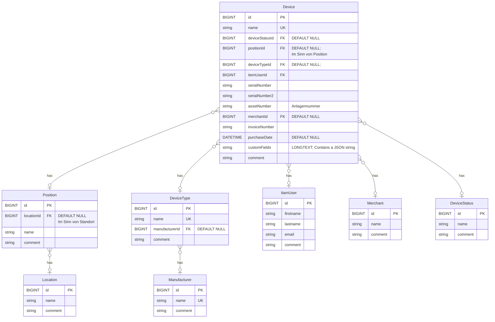

# IT Asset Management

ITAM (**IT Asset Management**) ist eine Nextcloud Erweiterung zur **Verwaltung von Hardwaregeräten** und **Verwaltung von Softwarelizenzen**.
Das Programm richtet sich an **KMU** (kleine und mittelständische Unternehmen) sowie Privatpersonen.

* Geräte-Verwaltung
* Lizenz-Verwaltung (Software-Lizenzen)
* Open Source + kostenfreie Nutzung (MIT-Lizenz)
* Release im Nextcloud Appstore zur einfacheren Installation ist geplant.

<br><br>
<br><br>

## Roadmap

* Device Entität umsetzen:
    - ✅ Übersichts-Seite für die Geräte umsetzen:
        - ✅ Tabelle Element für Element in einzelne wiederverwendbare Module aufteilen.
            - ✅ Tabelle insgesamt in neues Modul auslagern.
            - ✅ Tabellenkopf in eigene Komponente auslagern.
            - ✅ Tabellen-Body in eigene Komponente auslagern.
            - ✅ Tabellenspalte (Zelle) in eigene Komponente auslagern.
        - ✅ Pagination in eigene Komponente auslagern
        - ✅ Alte Elemente in VueJs entfernen, die aktuell noch als Referenz enthalten sind.
        - ✅ Action-Spalte hinzufügen.
    - ✅ Detail-Seite erstellen zum Anlegen und Bearbeiten
        - ✅ Eingaben prüfen
            - ✅ Erste Version der Eingabeprüfung umsetzen.
            - ✅ Frontend-Ausgabe von Fehlern beim Speichern umsetzen.
        - ✅ Ausgaben escapen -> ist nicht notwendig, so lange wir nicht mit v-html binden. Vue escaped die anderen Werte automatisch.
        - ✅ Alle Werte hinzufügen (Entitäten, "normale" Felder)
    - ✅ Controller
    - ✅ View
    - ✅ Speicher Aktion hinzufügen.
    - ✅ Einträge bearbeiten.
        - ✅ Füge Erfolgsmeldung hinzu, die angezeigt wird, wenn das Speichern erfolgreich war.
        - ✅ Es gibt offenbar einen Fehler mit dem Purchase Date. Es wurde weder geladen, noch richtig gespeichert.
    - ✅ Einträge löschen.
    - ✅ Entität in Datenbank erstellen.
    - ✅ Button "Neu" hinzufügen.
    - ✅ Paginierung funktioniert noch nicht.
    - ✅ Spaltensortierung funktioniert außer der des Namens noch nicht.
    - ✅ Vue.app umbenennen in DeviceList.vue.
    - ✅ Code für die nächsten Entitäten besser abstrahieren.
        - ✅ Beim Löschen eines Eintrages keinen nativen Dialog anzeigen, sondern stattdessen ein Overlay. Sonst kann man das umgehen - was kritische Ergebnisse haben kann.
        - ✅ Logik aus der DeviceList auslagern in eine Klasse Device, die dynamisch auf den Daten arbeitet.
        - ✅ Logik aus DeviceEditor ebenfalls auslagern in die Klasse Device. Das sollte die zentrale Klasse dafür werden.+
        - ✅ Denkbar ist jetzt noch eine Klasse DeviceApi oder ähnliches, welche die API-Logik noch etwas herauszieht, damit man schönen sauberen Code hat. Dann sollte es erstmal genug sein.
    - Geräte-Liste durchsuchbar und filterbar machen.
        - Geräteliste filterbar machen.
            - ✅ Eigene Komponente erstellen: SfxonFilterBar
            - Teilkomponenten dafür erstellen:
                - ✅ 1. Filter für Text-Felder / Number-Felder SfxonFilterFieldText
                - ✅ 2. Filter für Datum (von bis, mit Datum-Selector) SfxonFilterFieldDate
                - ✅ 3. Filter für Entitäten SfxonFilterFieldEntity
                    ✅ -> verwende hierzu Dropdown-Listen mit denen sich alle Werte von Entitäten auswählen lassen.
                    ✅ > unten drunter die aktuell ausgewählten Werte
                    ✅ -> Aktualisieren-Button
            - ✅ Controller: Filtereinstellungen entgegennehmen und Ergebnis filtern / suchen.
            - Filter für Standort hinzufügen (doppelte Tiefe)
            - Filter für Geräte-Typ-Hersteller hinzufügen (doppelte Tiefe)
            - Menge hinzufügen
            - Bild hinzufügen
            - QR-Code Generator hinzufügen

        - Geräteliste auch nach Entitäten sortierbar machen.
    - Menü hinzufügen, mit dem die Reihenfolge der Spalten geändert werden kann, sowie eingestellt werden kann, in welcher Reihenfolge gefiltert werden kann.

* Filter, Sortier und Spalten-Einstellungen auch in andere Entitäten aufnehmen (einheitlich).

* Rechte-Verwaltung integrieren. Die Bestandteile dürfen nur mit der notwendigen Berechtigung verwendet werden dürfen.

* Lizenz-Management integrieren.

* ✅ Alle weiteren Entitäten umsetzen:
    - ✅ Location
    - ✅ Position
    - ✅ Manufacturer/Hersteller
    - ✅ DeviceType
    - ✅ User: Benutzer werden erstmal "normale" Entität. Wir verwenden also nicht weiterhin die Benutzer von Nextcloud. Diese sollten dem Login vorbehalten bleiben (Design-Entscheidung).
    - ✅ Verkäufer (Merchant)

* ✅ DeviceStatus Entität umsetzen
    - ✅ Entität in Datenbank erstellen
    - ✅ Menüpunkt zum Verwalten von DeviceStati hinzufügen (verlinkt auf die Liste)
    - ✅ Liste darstellen
    - ✅ Button "Neu" hinzufügen
    - ✅ Einträge verwalten (CRUD)
    - ✅ nur Löschen, wenn ein Status nicht mehr in Device verwendet wird.
    - ✅ DeviceStatus in den Menüpunkten zum Verwalten von Geräten (Device) hinzufügen.

## Aktuelle Funktionen

Keine

## Kommende Funktionen

1. Hardware Inventar
2. Lizenz Management
3. Reporte
4. Export
5. Import


### Kommende Funktionen: 1. Hardware Inventar

Inventarisierung und Verwaltung von Hardware, bspw. Computer, Monitore, Notebooks, Laptops, Telefone, Headsets, Tastaturen, Mäuse, ...

Ein Datensatz im Inventar besteht unter anderem aus diesen Feldern:

- Geräte-Name
- Standort (bspw. "Filiale Allgäu" oder "Campus 1, Block A")
- Position (Arbeitsplatz 217)
- Kauf-Datum
- Verkäufer
- Inventarnummer (kaufmännisches Inventar)

und weitere. Die Felder sind neben Standard-Feldern flexibel erweiterbar.


### Kommende Funktionen: 2. Lizenz Management

Manage deine Software-Lizenzen.


### Kommende Funktionen: 3. Reporte und Exporte

ITAM unterstützt bei der Erstellung von Berichten und Exporten.
Jeder Report umfasst eine flexible Auswahl an Datensätzen und Feldern in auswählbarer Reihenfolge.
Es werden 2 Export-Formate unterstützt: druckbare HTML-Seiten und CSV-Dateien.


## Feature Requests

* QR-Codes als URLs (Chlorophylllius - Twitch)<br/>QR-Codes als URLs, welche direkt ins Asset-Maanagement verlinken.

* Bilder der Assets hinterlegen (Chlorophylllius - Twitch)

* Mengen-Angaben (bspw. bei Kabeln und Displays) (Chlorophylllius - Twitch)

* Custom-Fields

* Ausgeliehen an (Chlorophylllius - Twitch)
    - E-Mail Bestätigung / Ausgeliehen, zurückgegeben.

* Bearbeitungs-Historie (Chlorophylllius - Twitch)


## Systemvoraussetzungen

1. Nextcloud Version 33.x

## Installation

1. Projektordner in custom_apps oder apps verschieben.

2. Nextcloud Admin > Benutzer Icon (oben rechts) > Apps > Links im Menü "Deine Apps" > IT Asset Management<br>a) Custom App installieren<br>Aktivieren

<br><br>
---

# Entwickler Dokumentation


## Verwendete Technologien während der Entwicklung

* Docker Container (Beispiel docker-compose.yml siehe unten)

* Nextcloud

* Vue.js

* PHP

## Beispiel der Installation der Entwicklungsumgebung

### 1. Docker installieren

### 2. Ordner für das Projekt erstellen.
```
mkdir sfxonitam
chdir sfxonitam
```

### 3. docker-compose.yml in neuen Ordner kopieren oder erstellen:

```
nano docker-compose.yml
```

Datei-Inhalt:

```yml
version: "3"

services:
  itam:
    image: nextcloud:latest
    container_name: itam
    restart: always
    ports:
      - "88:80"
      - "22:22"
    networks:
      - web
    environment:
      - XDEBUG_ENABLED=1
      - XDEBUG_REMOTE_HOST=172.17.0.1
      - VIRTUAL_HOST="itam.local"
      - VIRTUAL_PORT=88
    volumes:
      - "./:/var/www/html"
      - "itam_db:/var/lib/mysql"
  itam_db:
    image: mariadb:latest
    container_name: mysql_itam
    networks:
      - web
    environment:
      - MYSQL_ROOT_PASSWORD=root
      - MYSQL_USER=nextcloud
      - MYSQL_PASSWORD=nextcloud
      - MYSQL_DATABASE=nextcloud
networks:
  web:
    external: false
volumes:
  itam_backend_cache:
    driver: local
  itam_db:
    driver: local
```

### 4. Docker Container starten

```bash
docker compose up -d
```

### 5. NVM und NPM installieren

```bash
# In den Container wechseln
docker exec -it itam bash

curl -o- https://raw.githubusercontent.com/nvm-sh/nvm/v0.39.7/install.sh | bash

export NVM_DIR="$HOME/.nvm"
[ -s "$NVM_DIR/nvm.sh" ] && \. "$NVM_DIR/nvm.sh"

nvm install --lts
nvm use --lts

node --version
```

Die Versionsnummer sollte ausgegeben werden. Es ist in der Regel nur notwendig, dass man über der benötigten Version liegt.
Nur in Ausnahmefällen sollte man exakt die in der beim kompilieren angegebene avisierte nmp Version verwenden.
Da hier nvm eingesetzt wird, sollte ein Wechsel dorthin kein Problem darstellen.

```bash
npm install
npm i --save @nextcloud/axios @nextcloud/dialogs @nextcloud/initial-state @nextcloud/l10n @nextcloud/router @nextcloud/vue-richtext vue-material-design-icons vue-click-outside
npm i --save-dev vite-plugin-eslint vite-plugin-stylelint


```

### 7. Einige ESLint Regeln deaktivieren (Optional)

Das reduziert die Anzahl an Warnungen, die beim Kompilieren ausgegeben werden, was die Ausgabe beim Kompilieren leichter lesbar macht.

```
nano eslintrc.cjs
```

Neuer Datei-Inhalt:

```cjs
module.exports = {
    globals: {
        appVersion: true
    },
    parserOptions: {
        requireConfigFile: false
    },
    extends: [
        '@nextcloud',
    ],
    rules: {
        'import/extensions': 'off'
        'jsdoc/require-jsdoc': 'off',
        'jsdoc/tag-lines': 'off',
        'vue/first-attribute-linebreak': 'off',
        'vue/html-indent': ['error', 4],
        'indent': ['error', 4],
    },
}

```

## Kompilieren von Vue.js

```bash
# 1. ssh into container or docker exec in container:
docker exec -it itam bash

# 2. Go to app directory.
cd /var/www/html/custom_apps/sfxonitam

# 3. Compile
npm run dev

# 4. Alternatively compile prod environment: npm run prod
```

## Datenbank Migration ausführen

# 2. Go to root directory.

```shell
# Go to nextcloud root directory.
cd /var/www/html

# Run upgrade.
php -d memory_limit=512M occ upgrade

# Disable Maintenance Mode.
php -d memory_limit=512M occ maintenance:mode --off
```

## Datenmodell



## Fragen während der Entwicklung

Nachfolgend habe ich Fragen zusammengestellt, die ich mir während der Entwicklung gestellt habe.

1. Was ist OCA für ein Namespace?

* OCA steht für „Owncloud Apps" – ein historisch gewachsener Name aus der Zeit, bevor Nextcloud aus ownCloud hervorgegangen ist. In Nextcloud hat er sich als Konvention erhalten. OCA taucht in zwei Kontexten auf:

a) PHP-Namespace (serverseitig)
\OCA\ ist der Top-Level-PHP-Namespace für alle Nextcloud-Apps. Nextcloud verwendet einen PSR-4-Autoloader, bei dem \OCA\MyApp auf das Verzeichnis /apps/myapp/lib/ gemappt wird. Nextcloud
Jede App bekommt also ihren eigenen Unter-Namespace darunter, z. B.:

\OCA\Files\Controller\...
\OCA\MyApp\Service\...

Dabei gilt: OCA ist für Apps reserviert, während der Kern von Nextcloud unter OC\Core liegt.


b) 2. JavaScript-Namespace (clientseitig)
Das globale window.OCA-Objekt stellt Namespaces für app-spezifisches JavaScript bereit. Apps registrieren sich unter diesem Objekt, um ihre APIs und ihren Zustand zugänglich zu machen.
Klassisches Beispiel wäre OCA.Files.fileActions. Dieser Ansatz gilt mittlerweile als weitgehend veraltet – moderne Apps sollen stattdessen das separate NPM-Paket @nextcloud/files verwenden.


2. Welche Datenbank-Wrapper werden verwendet?<br>
Offenbar läuft im Hintergrund DOCTRINE.


3. Kann ich im Ordner Controller einfach neue Controller hinzufügen,
oder läuft alles über ApiController und PageController?
  * Ich konnte es nur mit einem einmaligen CamelCase Dateinamen zum Laufen bekommen.
  * Ansonsten funktioniert es zuverlässig. Das Caching macht ggf. Probleme aktivieren und deaktivieren der App soll helfen -> das habe ich noch nicht gestetet. Ansonsten hilft das Anheben der Version und das Ausführen des App Update Mechanismus.


4. Wie funktioniert das Senden von Formularen inkl. CSRF Token?

Eine von Nextcloud bereitgestellte Version von axios fügt automatisch den benötigten CSRF-Token hinzu:

```js
// Axios importieren.
import axios from '@nextcloud/axios'

// Beispiel-Methode, welche Formulardaten sendet. name, invoiceDate und selectedUser sind jeweils Variablen im vue script -
// hier nicht definiert - sie würden weiter oben - also globaler definiert werden und an Eingabeelemente gebunden werden (v-model="name").
async function submitForm() {
    console.log('submitForm');

    if (!name.value) {
        // Fehlerbehandlung
        return
    }

    try {
        const response = await axios.post(
            generateUrl('/apps/sfxonitam/device/save'),
            {
                name:        name.value,
                invoiceDate: invoiceDate.value?.toISOString().split('T')[0] ?? null,
                userId:      selectedUser.value?.id ?? null,
            }
            // Kein manueller CSRF-Header nötig –
            // @nextcloud/axios ergänzt ihn automatisch!
        )
        console.log('Gespeichert:', response.data)
    } catch (error) {
        console.error('Fehler beim Speichern:', error)
    }
}
```

5. Woher kommt NcListItem, dass im VueJs Code von Nextcloud immer wieder verwendet wird?

NcListItem kommt aus dem offiziellen @nextcloud/vue-Paket – der zentralen Vue-Komponentenbibliothek von Nextcloud.

https://github.com/nextcloud-libraries/nextcloud-vue/blob/e5d5bd6e8abed8ef4670be69cd69beae237013c5/src/components/NcListItem/NcListItem.vue#L41


6. Wie kann man die Actions verwenden, wie es NcListItem macht?

NcListItem verwendet hierzu NcActions.
Da es sich hierbei ebenfalls um eine Component aus nextcloud-vue handelt, kann diese weiterverwendet werden.

NcActions und NcAction Button einbinden:
```
import NcActions from '@nextcloud/vue/components/NcActions'
import NcActionButton from '@nextcloud/vue/components/NcActionButton'
```


Im HTML-Teil definieren:
```
<NcActions>
    <NcActionButton @click="onEditDevice(device)">
        <template #icon>
            <NcIconSvgWrapper :path="mdiPencil" :size="20" />
        </template>
        Bearbeiten
    </NcActionButton>
    <NcActionButton @click="onDeleteDevice(device)">
        <template #icon>
            <NcIconSvgWrapper :path="mdiDelete" :size="20" />
        </template>
        Löschen
    </NcActionButton>
</NcActions>
```

Die Methoden müssen noch ausdefiniert werden, also hier bspw. onEdit und onDelete. Die übergebenen Parameter sind ein Daten-Objekt aus unserem Projekt.


7. Caching

Änderungen an Controllern werden nicht immer sofort übernommen.
Das Problem ist vermutlich der aktivierte opcache im Nextcloud Image.
Ich habe ihn folgendermaßen deaktiviert:

```cli
# Ordner angelegt:
[nextcloud-ordner]/php/

# Datei angelegt
nano ./php/zzz-opcache.ini

# Inhalt der Datei gespeichert:
opcache.enable=0
opcache.enable_cli=0
```

Anschließend in Docker-Compose unter Volumes folgendes eintragen:

```yml
- "./php/zzz-opcache.ini:/usr/local/etc/php/conf.d/zzz-opcache.ini"
```

Das sieht dann darin also in etwa so aus:
```
services:
  [...]
  itam:
    [...]
    volumes:
      - "./:/var/www/html"
      - "itam_db:/var/lib/mysql"
      - "./php/zzz-opcache.ini:/usr/local/etc/php/conf.d/zzz-opcache.ini"
```

Eine Anzeige der PHP-Ini sollte danach für den Wert ```opcache.enable``` den Wert ```Off``` ergeben.


8. Adminer

Wenn ich eine adminer.php in das Root-Verzeichnis lege, wird diese nicht angezeigt.

-> Grund: htaccess-Datei verhindert dies.

Einfach diese Zeile hinzufügen:

```
RewriteCond %{REQUEST_FILENAME} !/adminer\.php$
```

Sie muss kurz vor das Ende der Datei hier:

```
  RewriteCond %{REQUEST_FILENAME} !/richdocumentscode(_arm64)?/proxy.php$
  RewriteCond %{REQUEST_FILENAME} !/adminer\.php$
  RewriteRule . index.php [PT,E=PATH_INFO:$1]
  RewriteBase /
  <IfModule mod_env.c>
    SetEnv front_controller_active true
    <IfModule mod_dir.c>
      DirectorySlash off
    </IfModule>
  </IfModule>
</IfModule>
```
